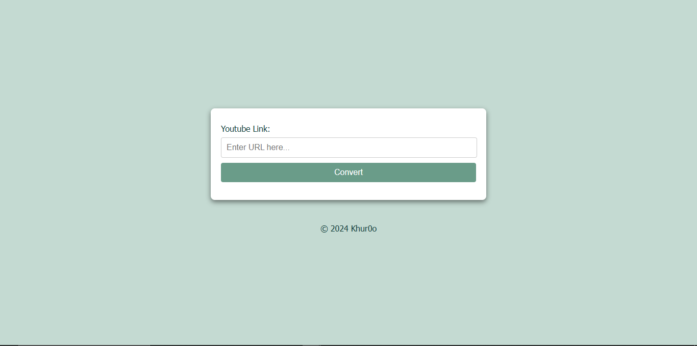
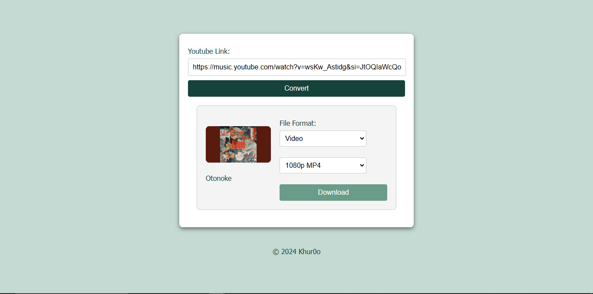

# YouTube Converter

A web application that allows users to convert YouTube videos to MP3 and MP4 formats, with customizable quality options. This project includes a frontend built with HTML, CSS, and JavaScript, and a Node.js backend for handling conversion requests.





Project Goal:
The goal of this project is to provide an easy-to-use platform for converting YouTube videos to downloadable formats without requiring any additional software. It is a great tool for users who want to extract audio from YouTube videos or save videos for offline viewing.

Converter web application [Homepage](webapp/frontend/public/index.html)

This project is licensed under the Apache License, Version 2.0. See the [LICENSE](./LICENSE) file for more details.

## Features

- Convert YouTube videos to MP3 audio or MP4 video formats.
- Customizable quality options:
  - MP3: Highest quality.
  - MP4: Multiple quality options (1080p, 720p, 480p).
- Simple and intuitive user interface.

## Tech Stack

### Frontend
- HTML5
- CSS3
- JavaScript

### Backend
- Node.js (Express)

### Development Tools
- Visual Studio Code

## Project Structure

- `frontend/`: Contains the client-side code for the web interface.
  - `index.html`: Main HTML file.
  - `styles.css`: Styling for the web interface.
  - `index.js`: JavaScript for handling UI interactions and conversion requests.

- `backend/`: Contains the server-side code for handling YouTube API requests.
  - `app.js`: Main server file with API endpoints.
  - `controllers/`: Directory containing controllers for YouTube conversion.
  - `services/`: Directory for services interacting with YouTube API and file processing.
  - `.env`: Stores API keys and configuration details.

## Prerequisites

1. **Node.js** (version 16 or later).
2. **npm** for installing dependencies.
3. **YouTube API Key**: Obtain a key from the [Google Developers Console](https://console.cloud.google.com/).
4. **Firebase Hosting** (for deploying frontend, optional): Install the Firebase CLI.

## Installation

### 1. Clone the repository

```bash
git clone https://github.com/Khuro/Youtube_Converter.git
cd Converter


